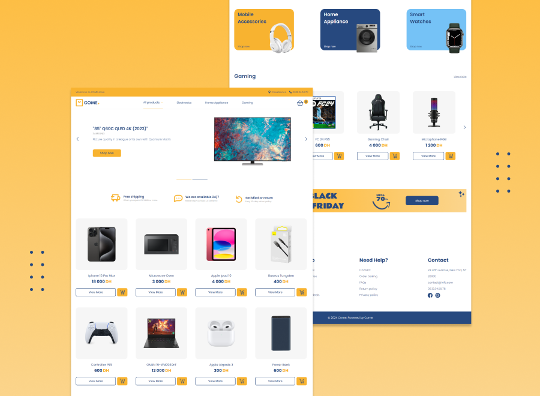

# E-commerce Website Frontend

## Welcome! 👋

The E-commerce Website Frontend project offers a seamless shopping experience with a modern and responsive interface. Users can browse products, add items to their cart, choose different variants, and complete their purchase with a smooth checkout process. The website adapts to various screen sizes and ensures a visually appealing and user-friendly interaction. Explore the full range of features by visiting the link below.

## Features

- Add products to the cart
- Choose product variants such as color and storage options
- View the product in the selected color by clicking on the color option
- Responsive design that adapts to different screen sizes
- View a summary of the cart and proceed to checkout
- Experience a smooth transition to the thank you page after a successful purchase
- Hover and focus states for all interactive elements on the page
- Receive form validation messages if:
  - Required fields are missed
  - The email address is not formatted correctly

## Tools Used

The E-commerce Website Frontend application includes the following tools:

- TypeScript
- React JS
- Tailwind CSS

## Getting Started

To use the E-commerce Website Frontend, simply navigate to the URL where it is hosted: https://mouasit.github.io/ecommerce-website
